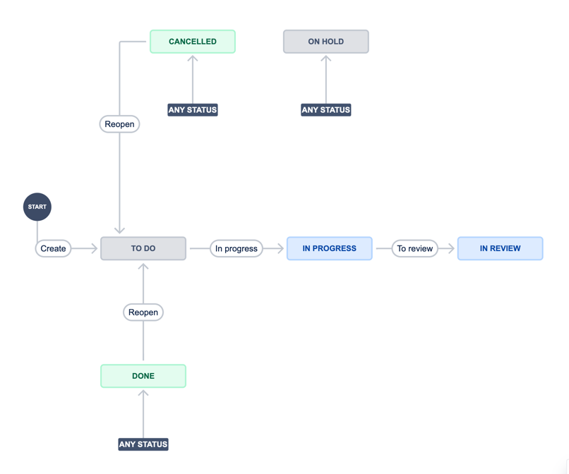
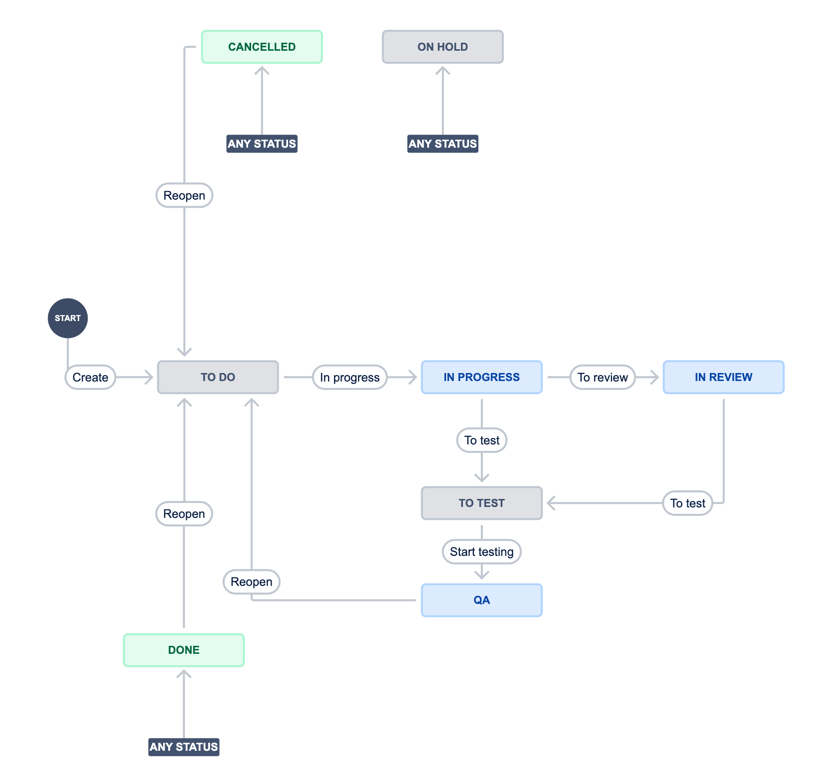

# Jira task types

We have 3 main types:

- Story
- Task
- Bug

All types of tasks have required fields:

- Summary
- Priority

## Story

This type is needed for a main task, business requests.
Usually, these tasks change the functional application.

For example:

- Adding a "I found a bug" form
- Integration facebook
- Remove the "contacts" page
- Home page redesign

### Workflow

## Task

This type is needed for technical tasks and other non-functional tasks

For example:

- Refactoring module 1
- Arrange a meeting with a client 1
- Verify something
- Architecture description for functionality 1

### Workflow

## Bug

This type need for bugs =)

This type has additional required fields:

- Actual result. In this field need to write the current result
- Expected result. In this field need to write the correct result

### Workflow

